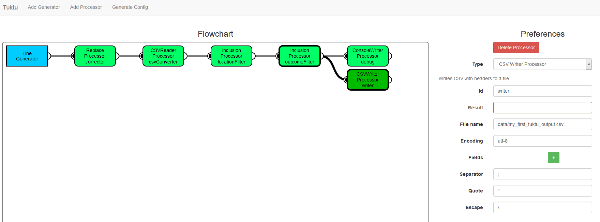

# Tuktu - Big Data Science Swiss Army Knife
Tuktu is a big data analytics platform that focuses on ease of use. The idea of the platform is that its users can focus on (business) logic rather than dealing with technical implementation details. Tuktu comes with a couple of key characteristics:

- Support for real-time and batch processing
- Synchronous and asynchronous processing
- A visual modeller that allows to create jobs using [drag-and-drop modelling](modules/modeller)
- Tuktu has its own distributed file system that is very easy to use - alternatively, Tuktu integrates seamlessly with HDFS (and local files of course)
- Tuktu also has its own in-memory distributed key-value store for quickly storing and retrieving data. Conceptually, this is close to [Spark](http://spark.apache.org/)'s RDD
- Tuktu has built-in real-time visualization capabilities for a number of pre-defined visuals
- Native support for web-analytics
- Periodic jobs can be scheduled natively from Tuktu
- By default there is no master/slave architecture, so no single point of failure
- Switch seamlessly between distributed and local (even transactional) computation paradigms
- Modular setup, with a number of modules like [Machine Learning](modules/ml) and [Social](modules/social) already worked out
- Automatic generation of documentation using the meta-files in the [modeller](modules/modeller)
- Easy usage and setup: download the zip file and run the startup script (Windows, Mac and Linux supported)

The name comes from the Inuït word *tuktu*, which freely translates to the English word *reindeer* (also known as *[caribou](http://en.wikipedia.org/wiki/Caribou)*).

# Users and Partners
The following companies or organizations use or actively contribute to Tuktu.

[BigData.Company](http://bigdata.company/) is the largest contributor to Tuktu and actively uses it as its core platform.

[RISA IT](https://www.risa-it.nl/) is a partner of the Tuktu platform and is using it in all of its big data science projects.

[EclipseIT](http://www.eclipseit.nl/) is a partner of the Tuktu platform and is using it in all of its big data science projects.

[AnyPinion](http://anypinion.com/) uses Tuktu for its API and real-time analytics module. AnyPinion has been an adopter of Tuktu from the very beginning.

[University of Maastricht](http://www.maastrichtuniversity.nl/) The University of Maastricht has been using Tuktu as the core platform for performing analytics on open source data on. The University of Maastricht has been using Tuktu from the very beginning.

Are you using Tuktu too and want to be on this list? [Contact us](mailto:info@et4it.nl) and send a small logo, a URL and a small explanation of what you are doing with Tuktu.

# Installing

Installing Tuktu can be done by either building from source as described below, or by downloading a fully packaged (including all the submodules mentioned here) release from the following URL:

[http://tuktu.et4it.nl/downloads/tuktu-1.0.zip](http://tuktu.et4it.nl/downloads/tuktu-1.0.zip) 

Note that Tuktu requires Java (JRE) to be present on the system it is run from. Tuktu requires **Java 8** to run or compile.

Note that in order to run Tuktu, you need to navigate a terminal or command prompt to the root folder and then execute the command `bin\tuktu(.bat)`. **(Do not run Tuktu from the bin-folder itself but always from the root-folder of Tuktu)**

# Building from Source

To build Tuktu from source, clone the repository. Tuktu was built against Play! version 2.3.x so you need that version of Play. Also, you need **Java 8**.

**Important note:** If you want to build Tuktu as-is from cloning the git repository - including the NLP module - you will need to have the following NLP libraries installed to your local Maven or otherwise present on the classpath:

- [LIGA](https://github.com/ErikTromp/LIGA) - Language Detection library
- [OpenNLPPOSWrapper](https://github.com/ErikTromp/OpenNLPPOSWrapper) - Part-of-Speech Tagging wrapper around the OpenNLP library
- [RBEM](https://github.com/ErikTromp/RBEM) - Multi-lingual Sentiment Analysis library

To build Tuktu (for production), run:

`activator clean dist`

This will generate a compressed archive in the *target/universal/* folder of the root folder of the Tuktu project. This archive can be extracted and contains a startup script named *bin/tuktu(.bat)* that can be used to start Tuktu in production mode.

To run Tuktu on your local machine for testing and to be able to modify it using the [Scala IDE](http://scala-ide.org/), run:

`activator clean eclipse ~run`

You can now navigate to [http://localhost:9000](http://localhost:9000) to access Tuktu's server.

# Usage

Tuktu offers a web interface that allows to access its core functionalities like submitting jobs and monitoring running jobs. Navigate to [http://localhost:9000](http://localhost:9000) to access the web interface.

Tuktu jobs are essentially JSON configuration files that live in a pre-defined folder (the *configs* folder by default). Configuration files should adhere to standards. To learn how to create configuration files, the best way to start is by looking at some [examples](examples_modeller.md) (if you want to see these examples from a configuration file perspective, [check here](examples.md)).

# Modeller

Instead of writing configuration files yourself, you can make use of a graphical modeller that saves a lot of work and makes configuration creation dead simple. The modeller is included in Tuktu and is accessible from Tuktu's UI.

The modeller lets you create data flows that can be run on Tuktu and looks a bit like this:

# Examples

Examples of Tuktu configuration files can be found on the [examples](examples.md) page.

# Extending

Tuktu is set up in a modular way and is easily extended, provided some rules are adhered to. Example extensions can be found in the *modules* subfolder. Extending the Tuktu platform requires cloning or downloading the sources from this repository as a whole, or at the very least the *api* submodule.

- Every extension should be placed in the *modules* subfolder.
- An extension can be a Play! project on its own, if it is required to use Play! libraries or to even add to the routing of Tuktu. If an extension is a Play! project, it must be of version 2.3.x to prevent version conflicts.
- Tuktu has a submodule named *api*. This provides bare-bones classes and utilities used in Tuktu. An extension should depend on this submodule.
- Package names should always start with the prefix `tuktu.`. It is good practice to place collections of typical processors in a `tuktu.[modulename].processors` package and generators in a `tuktu.[modulename].generators` package.
- Dependencies and project configurations of the submodule should be defined at the root project level and only there, do not create submodule-specific configuration and project files in the submodule folder itself. 

# Core Concepts

Tuktu is built around the [Play!](http://playframework.com/) framework. It hence lives as a basic HTTP server but has other ways of invoking it besides HTTP-based traffic. Tuktu makes heavy use of the Play! [Iteratee](https://www.playframework.com/documentation/2.3.4/api/scala/index.html#play.api.libs.iteratee.package) library and hence also [Akka](http://akka.io/)

There are two basic types of actors in Tuktu.

- Generators
- Processors

**Generators** are actors that gather data from the external environment (outside of Tuktu), for example from the filesystem, a remote location or by simply 'creating' data (think of a periodic time-tick). As soon as a generator has a data item that is complete, it will stream it into a series of processors.

**Processors** are actors that manipulate data in one way or another. Processors can be chained together, executed in parallel with a merge-step or can copy data into multiple subsequent processors. This way, Tuktu creates a tree of processors that operate on a single data packet injected by a generator.

## Dispatcher

The core component of Tuktu is an actor named the *Dispatcher*. This actor can receive specific requests that make it set up generators and their accompanying processors. It does so based on a JSON configuration file.

Requests to the Dispatcher can either be synchronous or asynchronous. Synchronous requests return the data in a streaming way after it has undergone all transformations by the processors. Asynchronous requests do not return results but have potential side-effects instead. If possible, it is always advised to use asynchronous requests.

By default, a generator is a single (Akka) actor that has processors living with it. This means that a generator and the entire pipeline of processors it reaches, live on the same node of a cluster. The implication is that transactional flows are trivially easy to model in Tuktu but the downside is that this can put a computational burden on the actor. A generator by default is created on the Tuktu-node that the Dispatcher is invoked on, but can be explicitly executed on a specific node by specifying so in the configuration file.

This typical transactional flow can be broken by processors that need do so. There are numerous meta-processors in Tuktu that are specifically designed to introduce an explicit asynchronicity, execute remote computations or initiate distributed computations.

## Configuration Files

The way the Dispatcher sets up a flow of generators and processors is by using a JSON configuration file. This file describes what generators and processors to use, with their respective individual configuration, and how to chain them together. Additionally, the configuration can dictate on which node a generator should be created.

A typical configuration can look something like this. Note that generator-specific configuration has been omitted for compactness.

    {
		"generators": [
			{
				"name": "tuktu.social.generators.TwitterGenerator",
				"result": "data",
				"config": {
					...
	 			},
				"next": [
					"tokenizer", "debug"
				],
				"node": "192.168.2.1"
			}
		],
		"processors": [
			{
				"id": "debug",
				"name": "tuktu.processors.ConsoleWriterProcessor",
				"result": "",
				"config": {
					...
				},
				"next": [ ]
			},
			{
				"id": "tokenizer",
				"name": "tuktu.nlp.TokenizerProcessor",
				"result": "tokens",
				"config": {
					...
				},
				"next": [
					"li"
				]
			},
			{
				"id": "li",
				"name": "tuktu.nlp.LIGAProcessor",
				"result": "language",
				"config": {
					...
				},
				"next": [
					"csv"
				]
			},
			{
				"id": "csv",
				"name": "tuktu.processors.CSVWriterProcessor",
				"result": "",
				"config": {
					...
				},
				"next": []
			}
		]
	}

Let's examine this configuration file in a bit more detail. Notice that specifying a processing flow in Tuktu does not require you to program any code, as the logic designer, you just configure the platform.

1. The generator that will be used here is of type `tuktu.social.generators.TwitterGenerator`. This generator is a special generator that comes from the *social* submodule of Tuktu. It connects to the [Twitter Streaming API](https://dev.twitter.com/streaming/overview) with specific credentials and filters to gather tweets. When a single tweets is returned by Twitter, it is forwarded to the first processors in line.
2. The processors that the generator first sends data to are the *tokenizer* and the *debug* processors. Note that this directly implies that data is being copied to multiple processors.
3. The *debug* processor is of type `tuktu.processors.ConsoleWriterProcessor` and simply writes data to stdout when it obtains some. The *tokenizer* processor is of type `tuktu.nlp.TokenizerProcessor` and stems from the NLP submodule of Tuktu. This processor splits text (for example, the tweet body) into tokens (words, figures, characters, etc.).
4. After tokenization, the data is sent to a language identification processor of type `tuktu.nlp.LIGAProcessor`. This processor enriches the data by adding a language field to it.
5. Finally, data is sent to a processor of type `tuktu.processors.CSVWriterProcessor`, which streams the data into a CSV file.

Using this configuration file, data is obtained from Twitter, written out for debugging, tokenized and has language identification applied to it. The result is finally written to a CSV file. Note that in this case, because we make use of the generator `tuktu.social.generators.TwitterGenerator`, the processing never ends, this is a perpetual process and hence the CSV file is never closed. There are specific generators however that can end their data ingestion, in which case the entire data processing pipeline is shut down and closed accordingly. In this case, the CSV file would be closed nicely.

# Generators and Processors
Tuktu has a fancy project that automatically creates javadoc-inspired documentation for all generators and processors based on the modeller's meta JSON files. [This project is called the TuktuDoccer](https://github.com/ErikTromp/TuktuDoccer) and can be found at [https://github.com/ErikTromp/TuktuDoccer](https://github.com/ErikTromp/TuktuDoccer). The documentation generated by this project can be found in the [documentation](documentation) folder.

# Standard Submodules

Tuktu comes with a number of submodules by default. Read more about them here.

- The [API](modules/api) submodule. This is actually part of Tuktu's core and used for extending the platform.
- The [CSV](modules/csv) submodule. In Big Data, CSV files are often used to export legacy data into NoSQL systems. This package helps with that.
- The [DB](modules/tuktudb) submodule. This module contains Tuktu's distributed in-memory database.
- The [DFS](modules/dfs) submodule contains the Distributed File System that comes with Tuktu. It also includes the File Browser that is accessible from the Tuktu UI. 
- The [ML](modules/ml) submodule. This module contains some machine learning functionality.
- The [Modeller](modules/modeller) contains the entire UI for the visual drag-and-drop modeller for Tuktu.
- The [NLP](modules/nlp) submodule. This module contains some algorithms on Natural Language Processing.
- The [NoSQL](modules/nosql) submodule. This module contains standard methods to read or write from and to some popular NoSQL systems.
- The [Social](modules/social) submodule. This module contains generators for social media and some basic processors. 
- The [Visualization](modules/viz) submodule. This module contains some default real-time visualization processors and endpoints to request graphs from them. 
- The [Web](modules/web) submodule. This module will deal with HTTP traffic and has functionality for performing web analytics.
