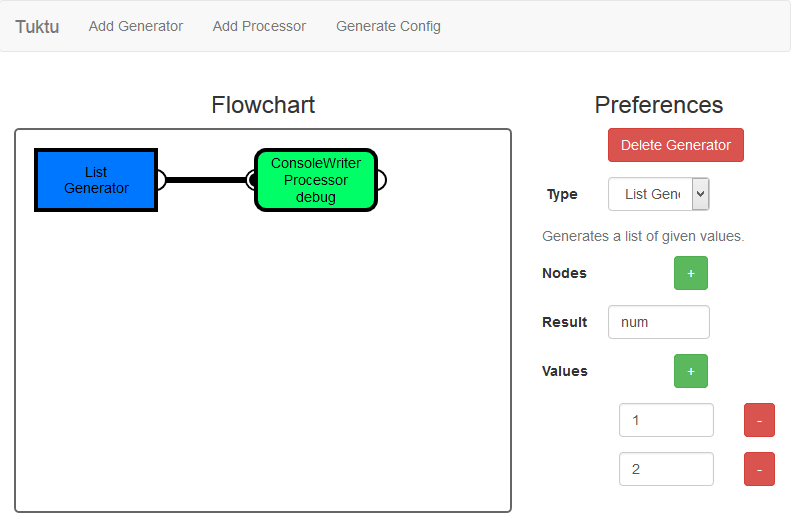

Example Configurations in Tuktu Using the Modeller
=========

Some example configurations are shown and outlined in the [examples readme](examples.md). While it is useful to learn how the configuration system of Tuktu works, most often you will not be dealing with this sort of flow consturction and rather use the modeller instead. Here we discuss how the modeller actually works, we will do so by using the same examples as outlined in the [examples readme](examples.md).

To start the modeller for a new flow, navigate to [http://localhost:9000](http://localhost:9000) after starting Tuktu and go to *Start a job*. On the top-right click the *New File* link and give it a meaningful name. Then click on the *Edit Config* link behind your newly created configuration file, this will take you to the modeller.

# A First Example
The very first example is trivially easy in the modeller. We will add a dummy generator and a processor that will write the dummy data to console.

Within the modeller, click on *Add Generator* and click on *Add Processor*. This will draw a blue (generator) and a green (processor) box on the canvas, you can drag them around with the left mouse button for clarity.

Click on the generator and on the right-hand side under **Type**, select the *List Generator*. You will get a number of fields that need to be populated. As for *Result*, enter *num*. Click on the green +-sign next to the **Values** field a couple of times and add some values in the appearing input fields.

Click on the processor and select the *Console Writer Processor* under the **Type** selector. For **Id**, punch in *debug* and do the same for **Result**.

Finally, we need to connect the generator to the processor. This is done by clicking on the white half-circle on the right side of the generator and holding down the mouse button while dragging it towards the black half-circle of the processor. Generally speaking, black half-circles are inputs whereas white half-circles are outputs.

Your flow should look something like this.

To store your flow, click on the *Generate Config* button at the top menu and finally click on the appearing *Save Config* button on the right.

Now that our flow is created and stored, we can run it. Return to Tuktu by clicking on *Tuktu* at the top left side of the modeller's menu. Go back to the *Start a Job* page and now click on the *Start Job* button located after the flow you just created. Tuktu will now execute your flow and you should see some output in the console.